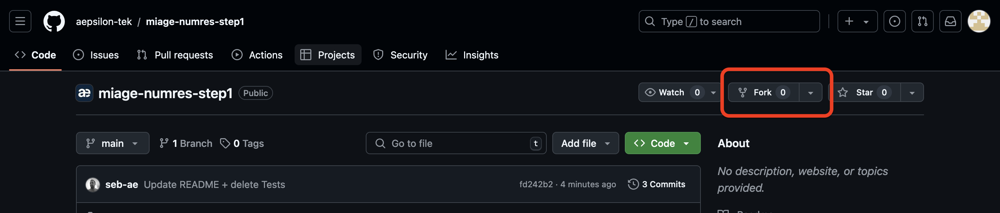
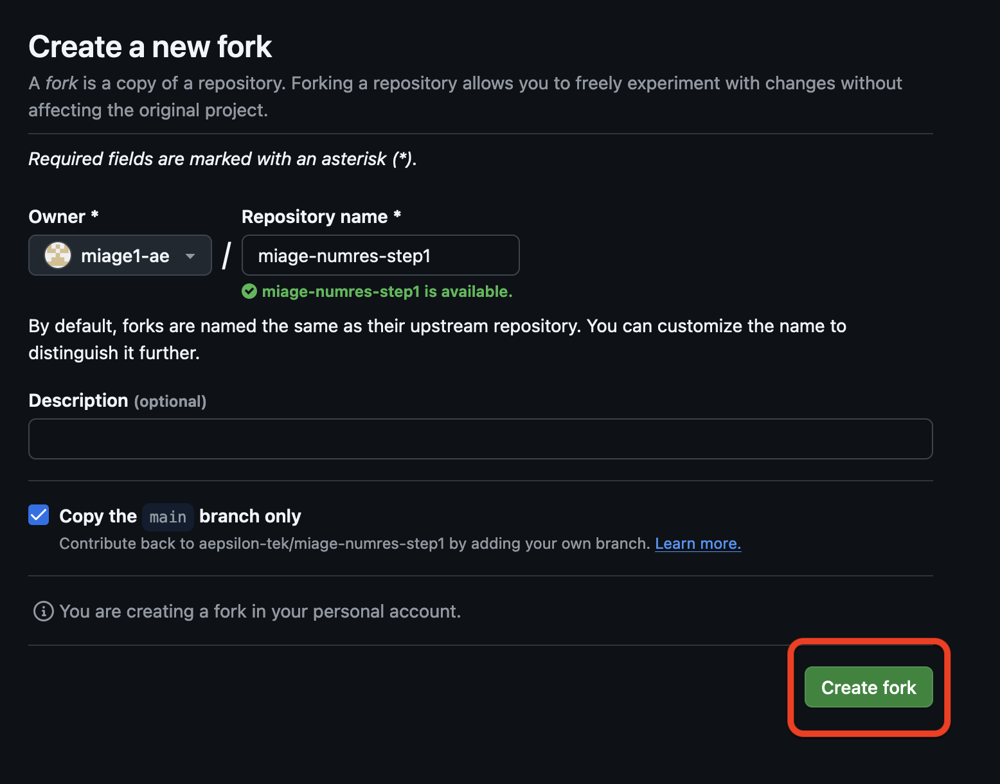

# Fork du projet
L'objectif est de créer une copie du projet 'miage-numres-step1' sur votre compte github.

1. Se rendre sur le projet github [miage-numres-step1] (https://github.com/aepsilon-tek/miage-numres-step1)
1. Fork du projet grâce au bouton




# Construction du projet
```sh
./mvnw clean compile 
```

Cette commande permet de compiler les 2 sous modules api-quarkus et api-springboot.

# 