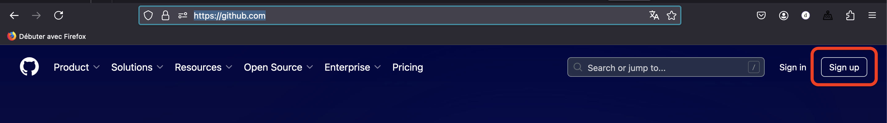
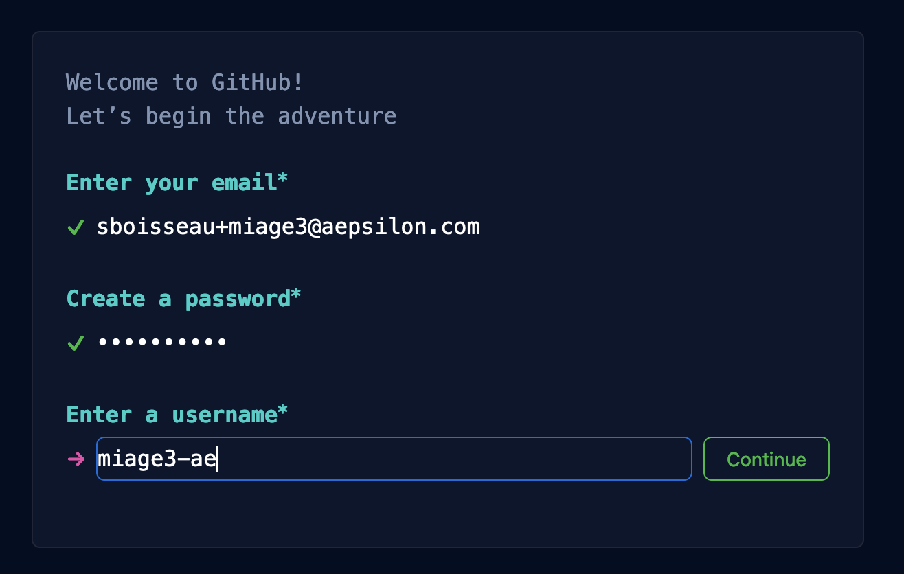
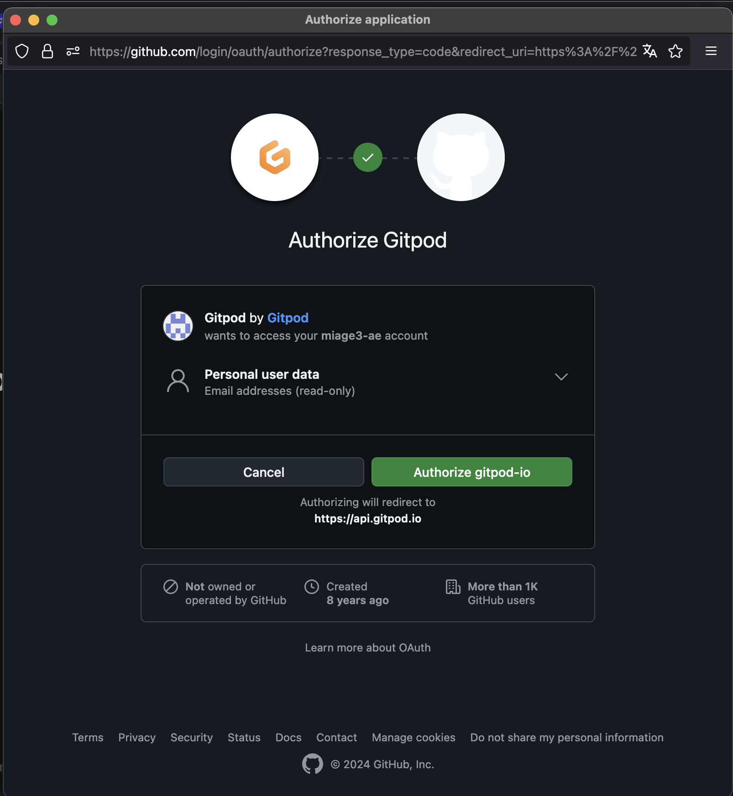
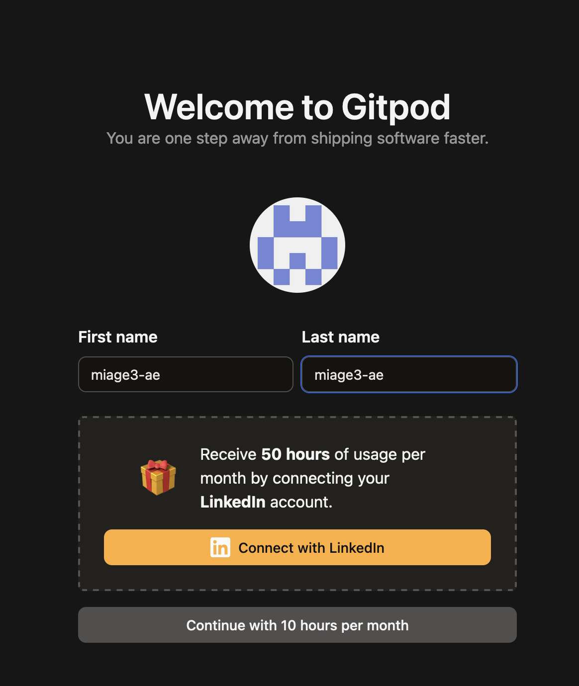
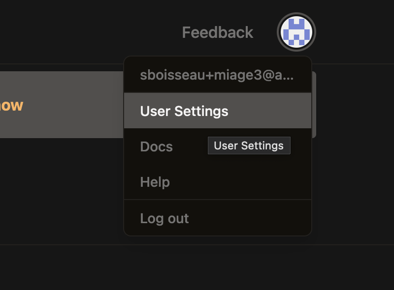
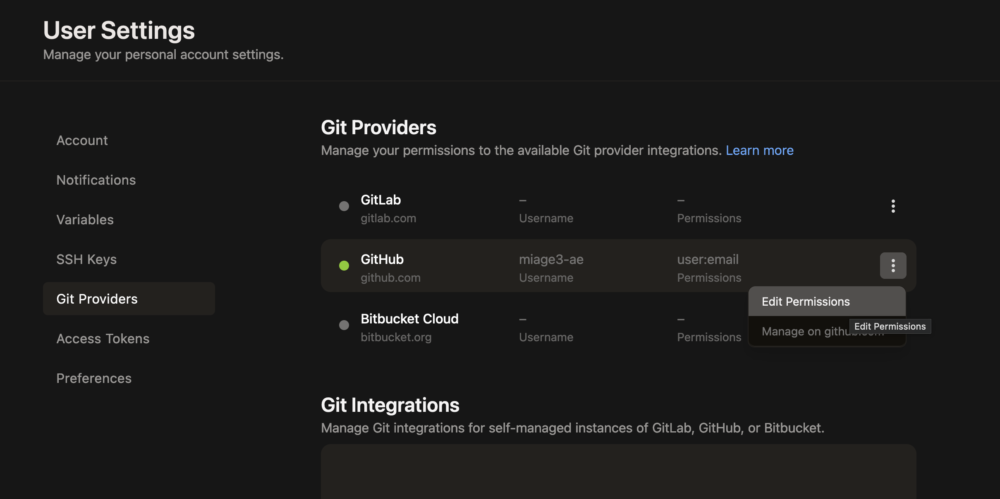
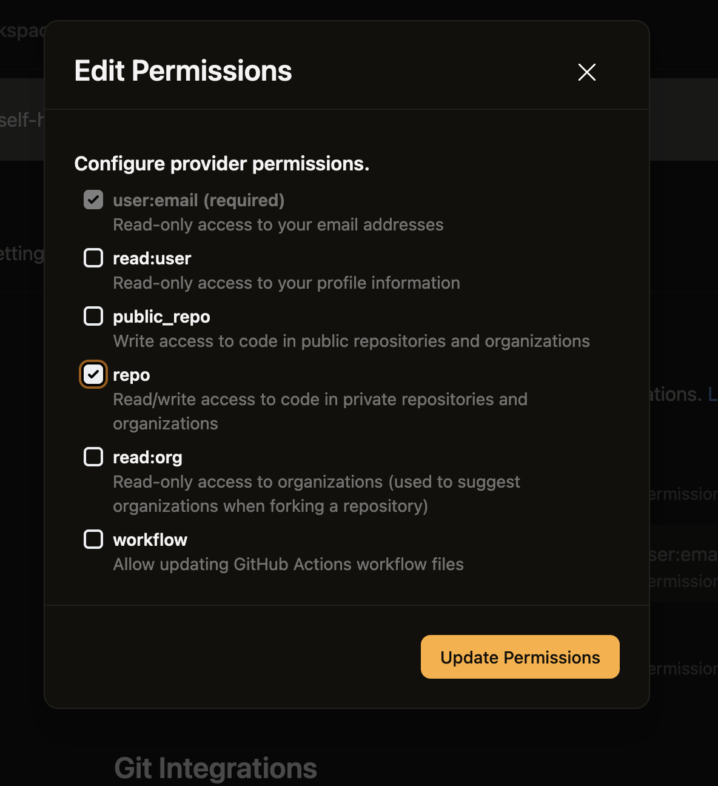

- [Creation des comptes](#creation-des-comptes)
  * [GitHub](#github)
  * [Gitpod](#gitpod)
    + [Creation compte](#creation-compte)
    + [Configuration du compte](#configuration-du-compte)
- [Fork du projet](#fork-du-projet)
- [Construction du projet](#construction-du-projet)
- [Utiliser gitpod](#utiliser-gitpod)
- [Api Springboot](#api-springboot)
  * [Lancement application 'springboot'](#lancement-application--springboot-)
  * [Test de l'API](#test-de-l-api)
  * [Modification Msg](#modification-msg)
  * [Mesure consommation mémoire](#mesure-consommation-m-moire)
- [Mode Dev Quarkus](#mode-dev-quarkus)
  * [Lancer l'application quarkus](#lancer-l-application-quarkus)
  * [Tester](#tester)
- [Commit  modifications](#commit--modifications)
- [PullRequest](#pullrequest)


# Sujet : Faire Burger Quizz !

Vous avez 4 séances de TD/TP pour  produire un site web qui permettent de répondre à des questions et  donne le score.

# Notation
 - 2pt  de rendu par séance
 - 12 pt de QCM/Questions ouvertes lors du dernier tp  (1H dernière seance)

> [!WARNING]
> Noubliez pas de faire votre pullRequest en fin de td/tp

# Environnement
L'ensemble des  4 TD/TP sont à réaliser sur **_Gitpod_**.

**_Gitpod_** est une plateforme de développement cloud qui permet de configurer des environnements de développement prêts à l’emploi pour tout projet, directement depuis un dépôt Git.
 Elle automatise la préparation des environnements (dépendances, configurations, etc.),
  réduisant ainsi le temps d’installation et les problèmes de compatibilité.
  Grâce à son intégration avec des outils comme GitHub, GitLab, et Bitbucket, Gitpod propose des espaces de travail reproductibles et éphémères.


# Déroulement
Dans le monde de l'*Open Source*, lorsque l'on veut contribuer à un projet, on propose des évolutions à une base de code (un **repo**) qui  seront approuvées ou non par un validateur (**reviewer**). C'est ce que l'on appel  **faire une PR**.

Vous allez reproduire le processus d'une PR pour chacun des TD/TP.

Ainsi pour chacun des TD/TPS, il faudra:
1. Dupliquer (**Forker**) le projet github
1. Modifier / compléter des fichier du repo. forké
1. Commiter vos modifs sur votre repo.
1. Proposer vos modifications sur le repo. parent (**PullRequest**)

# Creation des comptes
Vous allez créer 2 comptes: un sur GitHub et un sur GitPod. Ces comptes seront utilisés lors des 4TD/TP.

## GitHub
Dans cette section nous créons un compte sur Github. Si vous en avez déjà vous pouvez passer à l'étape suivante.
1. Se rendre sur https://github.com
1. Bouton Sign up

1. Remplissez  le formulaire d'inscription

1. Connecter vous au site github avec le nouveau compte créé
1. Remplissez le formulaire

## Gitpod
### Creation compte
1. Se  rendre sur https://gitpod.io et se cconnecter avec Github

1. Authoriser Gitpod à accèder à votre compte Github

1. Selectionner la formule à 1Ohrs/mois

1. Préciser que vous etes étudiant

### Configuration du compte
Il faut ajouter à votre compte gitpod le droit de pouvoir  lire&ecrire sur vos repos github.
1. Se connecter à votre compte Gitpod
1. Se rendre  dans votre paramètres de comptes

1. Editer les parametres de vote liaison à Github dans le menu 'Git Provider'

1. Ajouter le droit de lecture/ecriture à vos repos à travers Gitpod


# Fork du projet
L'objectif est de créer une copie du projet 'miage-numres-step1' sur votre compte github.

1. Se rendre sur le projet github [miage-numres-step1] (https://github.com/aepsilon-tek/miage-numres-step1)
1. Fork du projet grâce au bouton


# TP1 -
Objectif TP1

# Utiliser gitpod


# Api Springboot
## Lancement application 'springboot'
```
 ./mvnw spring-boot:run  -pl api-springboot
```

## Test de l'API
1.Récupération de l'url de l'api
1.Appel dans le navigateur de l'ordinateur

## Modification Msg
1. Dans le terminal, construire l'application springboot
```sh
```
2. Se déplacer dans le répertoire `target`
3. Lancer la commande `java -jar `

## Mesure consommation mémoire


# Mode Dev Quarkus
## Lancer l'application quarkus
```sh
./mvnw quarkus:dev -pl api-quarkus
```

## Tester
Ouverture de port


# Commit  modifications

# PullRequest

# Commandes Utiles
* ```./mvnw clean compile ``` : Compilation des 2 modules (`api-quarkus` et `api-springboot` ) du projet
